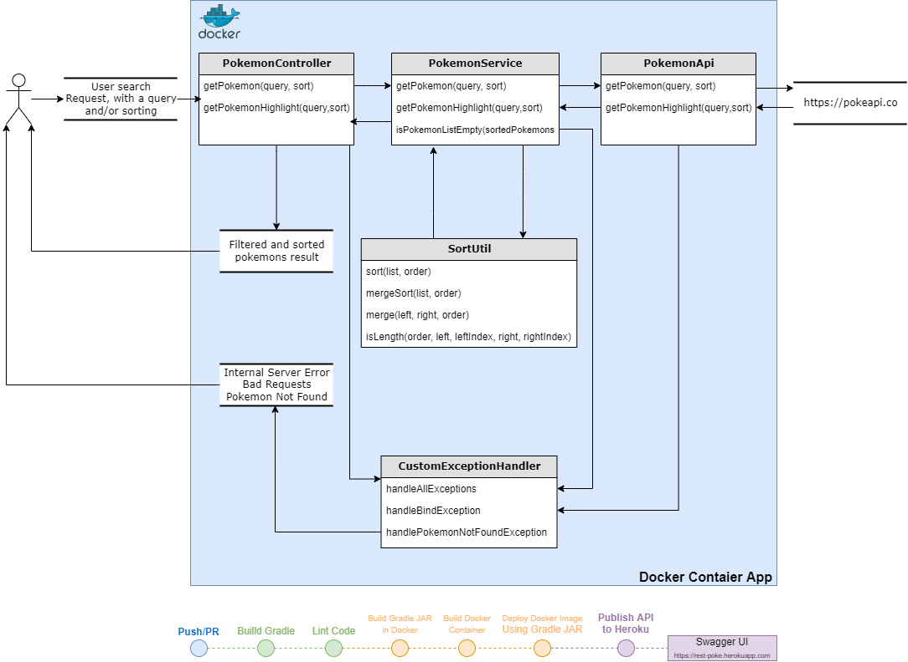

---

# 💻 Projeto

API REST que consome a [PokéAPI](https://pokeapi.co/) data base, com dois endpoints que o usuário passa um parâmetro para buscar um Pokémon ou um grupo de Pokémons.
### Deploy da API no Heroku (https://rest-poke.herokuapp.com) usando a interface do Swagger.

---

# 📚 API
    GET /pokemons?query=<nome do Pokémon>&sort=<nome do atributo> 
    - Busca todos os Pokémons que contenham o nome do Pokémon passado como parâmetro e ordena-os pelo atributo 
    passado como parâmetro.
    
    GET /pokemons/highlight&query=<nome do Pokémon>?sort=<nome do atributo> 
    - JSON com o Pokémon que contenha o nome do Pokémon passado como parâmetro e destaca-o pelo atributo passado 
    como parâmetro e ordena-os pelo atributo passado como parâmetro.

    Params:
    - query: String, obrigatória.
    - sort: Enum, opcional (para o usuário). 
    Se o parâmetro não for fornecido, o padrão da classificação é alfabética.

    O objetivo deste endpoint é permitir que os usuários pesquisem pokémons pelo nome. 
    O usuário enviará uma parte (qualquer parte) do nome do pokémon como parâmetro de consulta, e o serviço 
    deverá responder com uma lista de pokémons. A diferenciação entre maiúsculas e minúsculas deve ser usada
    na pesquisa.

    No endpoint Highlight, a response também deve destacar a substring que corresponde ao nome do pokémon. 
    A maneira como isso é feito é envolvendo a substring com tags <pre> </pre>.

    Além disso, o usuário deve ser capaz de escolher o tipo de classificação que deseja, e o serviço deve ordenar 
    a lista de pokémons na ordem solicitada.

---

# 🔀 Merge Sort
    Merge Sort é um algoritmo de divisão e conquista. Ele divide a matriz de entrada em duas metades, chama a si mesmo 
    pelas duas metades e depois mescla as duas metades classificadas. A maior parte do algoritmo recebe dois arrays 
    ordenados, e temos que mesclá-los em um único array ordenado. Todo o processo de ordenação de uma matriz de N 
    inteiros pode ser resumido em três etapas:

	- Divida a matriz em duas metades.
	- Classifique a metade esquerda e a metade direita usando o mesmo algoritmo recorrente.
	- Mesclar as metades ordenadas.

    Colocando em linguagem simples, dividimos o subproblema em duas partes em cada etapa e temos uma quantidade linear 
    de trabalho que precisamos fazer para mesclar as duas metades classificadas em cada etapa.
    
    Complexidade:
    A maior vantagem de usar Merge sort é que a complexidade de tempo é apenas n*log(n) para classificar um Array inteiro.
    
    Propriedades:
    - Complexidade Espacial: O(n)
    - Complexidade de Tempo: O(n*log(n)). O fator log(n) que entra é por causa da relação de recorrência.
    - Estável: Sim

---

# 📃 Diagrama
<p align="center">
  
</p>

---

# 🚀 Tecnologias

<h2 align="center">Esse projeto foi desenvolvido com as seguintes tecnologias:</h2>

<p align="center">
  
  
  
  
  
  
  
  
  
</p>

---

# 👨‍💻 Como rodar o projeto:

## 🌐 Heroku

```bash
# Acesse a interfacer do swagger direto pela url:
https://rest-poke.herokuapp.com
```

## 🐳 Docker

```bash
# Clone o repositório e rode o comando na raiz do projeto:
docker-compose up

# Com o servidor rodando você poderá acessar a interfacer do swagger direto pela url:
http://localhost:5000/
```

## 🔨 Local

```bash
# Clone o repositório e rode o comando na raiz do projeto:
gradle :clean :build or ./gradlew :clean :build

# Depois disso, abra a classe RestPokeApplication.kt, ela se encontra em src/main/kotlin, e dê run no método main()

# Com o servidor rodando você poderá acessar a interfacer do swagger direto pela url:
http://localhost:5000/
```